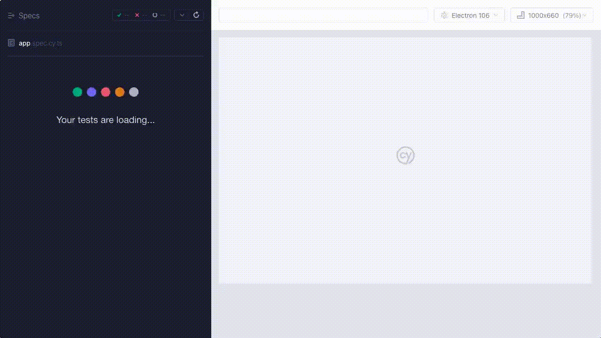

# Airwallex Frontend Project

## Getting Started

Install dependencies,

```bash
$ yarn install
```

Start the dev server,

```bash
$ yarn start
```

For unit tests, please run:

```bash
$ yarn test
```

For e2e tests, please start the dev server first, then run:

```bash
$ yarn e2e
```



## Folder structure

```
.
├── cypress
│   └── e2e                   # e2e tests
│       └── app.spec.cy.ts
├── src
│   ├── components          # reusable components
│   │   ├── button
│   │   ├── header
│   │   ├── footer
│   │   ├── modal
│   │   └── form
│   ├── constants                     # constants
│   │   ├── keypoints.ts              # screen sizes for responsive design
│   │   ├── strings                   # centralized all the strings used in the app
│   ├── pages                         # page entries
│   │   ├── home.ts                   # home page
│   │   └── request-invite-form.ts    # handle the main logic
│   ├── api                      # API requests
│   │   ├── request.ts               # api call method
│   └── utils                         # util functions
│   │   └── hooks
│   │        └── usePostRequestInvite.ts            # customized hook function, wrapping api method into react query
│   │        └── useEventListener.tsx            # hook to add eventListener to an element
├── tsconfig.json
├── cypress.json                      # e2e config
├── package.json
├── yarn.lock
└── README.md
```
